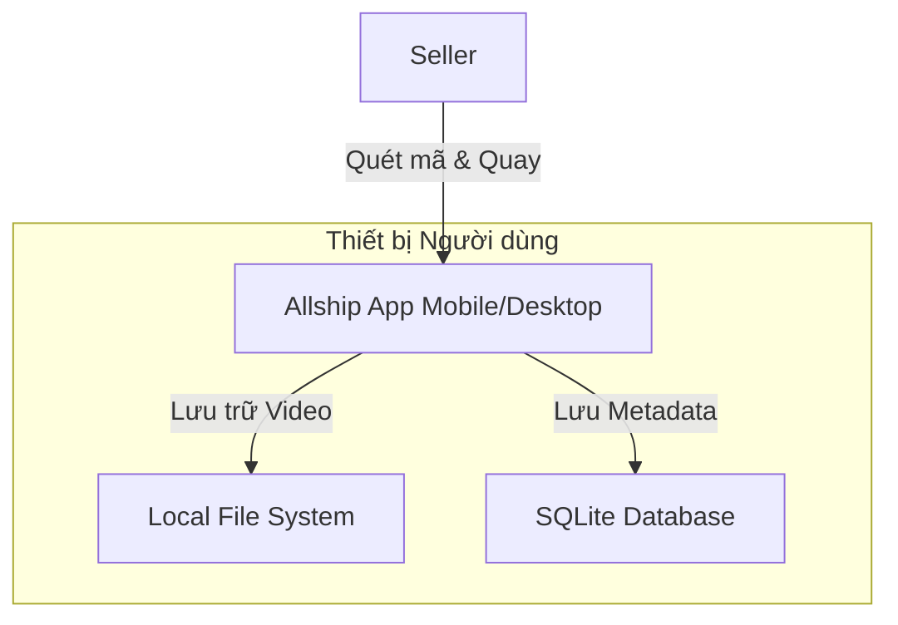

# Kiến trúc Hệ thống Tổng quan

Hệ thống được thiết kế theo tư duy **Local-First**, đặt dữ liệu và khả năng xử lý tại thiết bị của người dùng (Edge Device) là ưu tiên hàng đầu.

## 1. Sơ đồ Kiến trúc

### A. Mô hình Local-First (Cơ bản - Miễn phí)
Đây là mô hình hoạt động độc lập, không phụ thuộc Internet.



**Đặc điểm:**
-   **Offline 100%:** Mọi tính năng hoạt động bình thường khi mất mạng.
-   **Zero Latency:** Truy xuất dữ liệu tức thì từ ổ cứng.
-   **Privacy:** Dữ liệu chỉ nằm trên thiết bị.

### B. Mô hình Hybrid (Nâng cao - Có Cloud Sync)
Mô hình mở rộng cho phép đồng bộ dữ liệu giữa nhiều thiết bị và backup an toàn.

```mermaid
graph LR
    subgraph Device1 [Thiết bị 1 - Đóng gói]
        App1
        DB1[SQLite]
        LocalFile1
    end

    subgraph Device2 [Thiết bị 2 - Quản lý]
        App2
        DB2[SQLite]
        LocalFile2
    end

    subgraph Cloud [Cloud System]
        API[Sync Service]
        MetaStore[Metadata DB]
        FileStore[S3 Object Storage]
    end

    App1 -->|Sync Metadata| API
    App1 -.->|Backup Video (Optional)| FileStore
    
    API -->|Sync Metadata| App2
    App2 -.->|Stream Video| FileStore
```

**Cơ chế Sync:**
1.  **Metadata Sync:** Đồng bộ thông tin đơn hàng, trạng thái, đường dẫn video... (Dung lượng nhỏ, real-time).
2.  **Video Sync (Optional):** Chỉ upload video khi người dùng yêu cầu hoặc có cấu hình (ví dụ: chỉ upload qua WiFi, chỉ upload đơn hàng hoàn).

## 2. Các thành phần chính

### Client App (Flutter/Electron)
-   **Camera Module:** Quản lý input camera, preview, recording.
-   **Scanner Module:** Lắng nghe sự kiện từ máy quét barcode (HID) hoặc xử lý hình ảnh từ camera (ML Kit).
-   **Core Engine:** State Machine quản lý workflow, logic tự động hóa.
-   **Storage Manager:** Quản lý file video, dọn dẹp tự động, truy vấn SQLite.

### Local Database (SQLite)
-   Lưu trữ thông tin đơn hàng, lịch sử quay, đường dẫn file.
-   Đánh index tối ưu cho việc tra cứu theo Mã vận đơn.

### File System
-   Lưu trữ video file `.mp4` và thumbnail `.jpg`.
-   Tổ chức theo cấu trúc cây thư mục thời gian.
