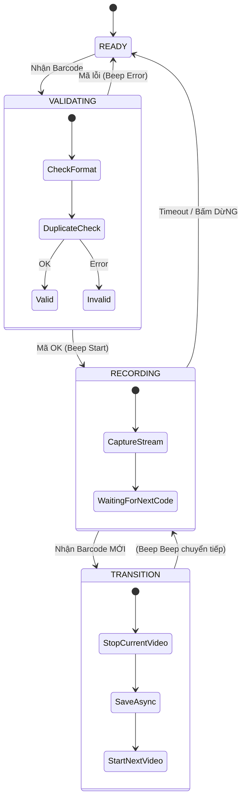

# Tính năng: Continuous Scan Mode (Quét Liên Tục)

Đây là chế độ quan trọng nhất giúp tối ưu hiệu suất làm việc (Hands-free), giúp nhân viên không cần chạm vào màn hình điện thoại/máy tính.

## 1. State Machine

## 2. Chuyển đổi liền mạch (Seamless Transition)
Mục tiêu: Thời gian chuyển đổi giữa 2 video phải **< 500ms**.

Khi đang quay đơn A và nhận được mã đơn B:
1.  **Freeze Preview (Optional):** Có thể giữ 1 frame đen hoặc làm mờ nhẹ để báo hiệu chuyển đổi.
2.  **Stop (A):** Dừng ghi vào file A.
3.  **Background Task:** Đẩy task finalize file A và update DB vào background thread. Không block UI.
4.  **Start (B):** Khởi tạo file B và bắt đầu ghi ngay lập tức.
5.  **Audio Feedback:** Phát âm thanh "Beep-Beep" (2 tiếng) đặc trưng để user biết đã chuyển đơn thành công mà không cần nhìn màn hình.

## 3. Xử lý mã trùng lặp (Duplicate Detection)
Khi đang quay đơn A, nếu người dùng vô tình quét lại mã đơn A:
-   **Hành động:** KHÔNG dừng quay. KHÔNG tạo video mới.
-   **Phản hồi:** Phát âm thanh cảnh báo "Warning Beep" (3 tiếng ngắn) và hiện thông báo "Mã đã quét - Đang tiếp tục quay".
-   **Lý do:** Tránh việc video bị cắt vụn do quét nhầm.
