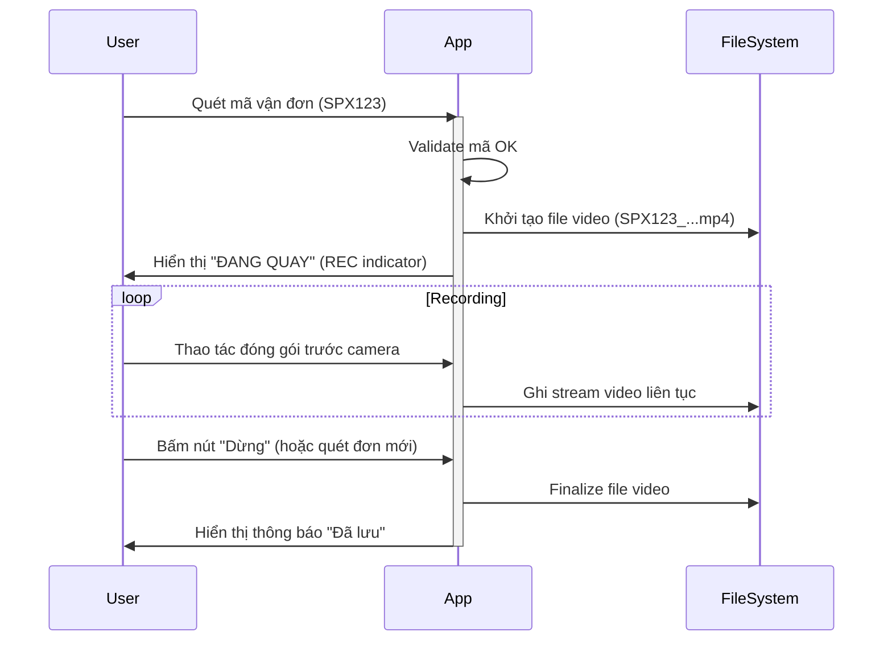

# Tính năng: Quay & Lưu Video

Tính năng cốt lõi của ứng dụng, đảm bảo video được ghi lại đầy đủ làm bằng chứng.

## 1. Thông số Video
-   **Độ phân giải:**
    -   Mặc định: **720p (1280x720)**. Tối ưu dung lượng và chất lượng.
    -   Tùy chọn: 1080p (cho nhu cầu cao).
-   **Codec:** **H.264 (AVC)**.
-   **Container:** **Fragmented MP4 (.mp4)**.
-   **Bitrate:** Variable Bitrate (VBR). Target 2-4 Mbps.
-   **FPS:** 20-24 fps.

## 2. Quy trình Quay Video (Basic Flow)

## 3. Overlay & Metadata
Trên video ghi lại (burn-in) hoặc hiển thị trên UI khi quay:
-   **Mã vận đơn:** Hiển thị to, rõ ràng.
-   **Timestamp:** Thời gian thực (Ngày giờ phút giây) chạy liên tục.
-   **Watermark:** Logo app (tuỳ chọn).

Việc này giúp video có giá trị bằng chứng cao hơn khó bị làm giả.

## 4. Cơ chế Timeout
Để tránh việc người dùng quên tắt quay khiến video dài vô tận và đầy bộ nhớ:
-   **Auto-stop:** Sau 5 phút (có thể cấu hình) quay liên tục, App sẽ tự động dừng quay, lưu video và phát cảnh báo.
