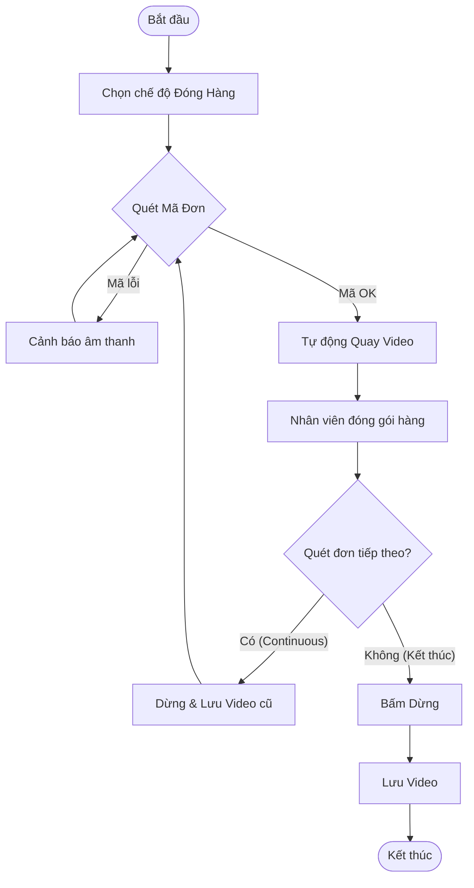

# Workflow: Đóng Hàng (Packing)

Quy trình chuẩn cho nhân viên đóng gói.

## Lưu đồ (Flowchart)

## Các bước chi tiết

1.  **Chuẩn bị:** Mở App, đặt điện thoại/camera ở vị trí có thể nhìn thấy toàn bộ bàn đóng gói. Kết nối máy quét (nếu có).
2.  **Kích hoạt:** Chọn chế độ "Đóng hàng". App chuyển sang màn hình Camera Preview.
3.  **Thao tác lặp (Vòng lặp đóng gói):**
    *   **Bước 3.1:** Cầm phiếu gửi hàng, quét mã vạch qua máy quét hoặc đưa vào trước camera.
    *   **Bước 3.2:** Nghe tiếng "Beep" xác nhận. App bắt đầu quay (REC).
    *   **Bước 3.3:** Giơ sản phẩm lên trước camera (soi 6 mặt nếu cần), gói hàng, dán phiếu gửi hàng.
    *   **Bước 3.4:** Đẩy gói hàng đã xong sang một bên.
    *   **Bước 3.5:** Cầm phiếu gửi hàng tiếp theo và quay lại Bước 3.1.
4.  **Kết thúc:** Khi hết ca hoặc hết hàng, bấm nút "Dừng" trên màn hình.

## Yêu cầu hình ảnh
-   Thấy rõ mã vận đơn trên phiếu.
-   Thấy rõ sản phẩm khi đưa vào hộp.
-   Thấy rõ thao tác dán băng keo niêm phong.
