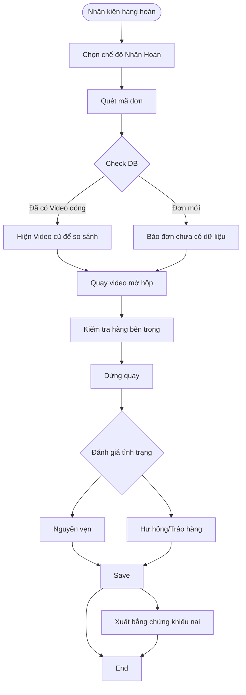

# Workflow: Nhận Hàng Hoàn (Return)

Quy trình xử lý đơn hàng bị hoàn trả về shop.

## Lưu đồ

## Các bước chi tiết
1.  **Tiếp nhận:** Nhận bao hàng hoàn từ bưu tá.
2.  **Quét mã:** Quét mã vận đơn. App sẽ hiện ngay thông tin đơn này đi ngày nào, ai đóng.
3.  **Quay mở hộp:**
    -   Quay rõ 6 mặt kiện hàng trước khi khui (xem có dấu hiệu rạch trước không).
    -   Quay quá trình cắt, mở hộp.
    -   Quay lấy sản phẩm ra và test sơ bộ.
4.  **Đánh giá:** Chọn trạng thái trên App (Nguyên vẹn / Hư hỏng / Tráo hàng).
5.  **Lưu trữ:** Video được lưu với tag `return` và link với đơn gốc.
