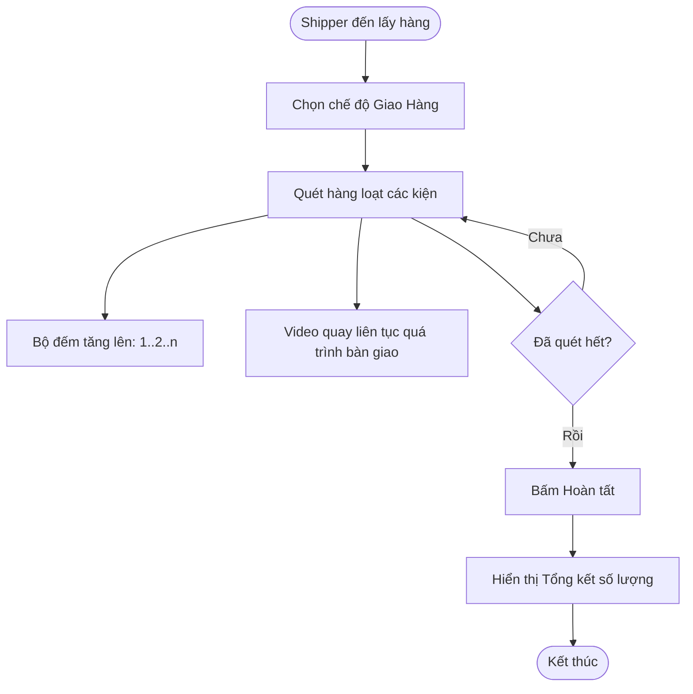

# Workflow: Giao Hàng (Shipping Out)

Quy trình bàn giao hàng cho bưu tá (Shipper). Mục đích là chứng minh shop đã giao đúng số lượng kiện hàng cho đơn vị vận chuyển.

## Lưu đồ

## Điểm khác biệt so với Đóng gói
-   **Chế độ quay:** Quay liên tục (Long Take) hoặc Batch Recording chứ không ngắt từng đơn lẻ.
-   **Mục tiêu:** Đếm số lượng và ghi hình kiện hàng được ném lên xe tải/bỏ vào túi shipper.
-   **Metadata:** Một video Shipping có thể liên kết với nhiều Mã vận đơn (One-to-Many).

## Các bước chi tiết
1.  Shipper đến.
2.  Nhân viên chọn "Giao Hàng".
3.  Bắt đầu quay video toàn cảnh khu vực chất hàng.
4.  Lần lượt cầm từng gói hàng, quét mã (để hệ thống điểm danh), rồi đưa cho Shipper.
5.  App sẽ hiển thị: "Đã giao: 15 đơn".
6.  Kết thúc: Lưu video và danh sách các mã đơn đã giao trong phiên này.
