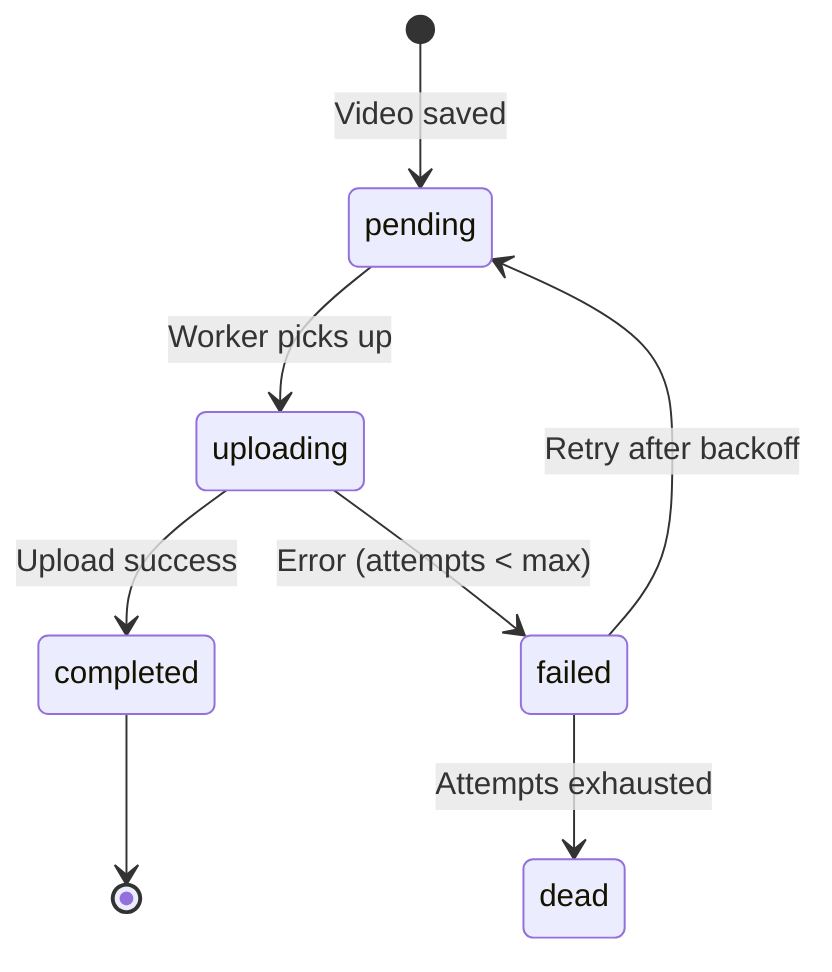

# Sync Queue (Hàng đợi Đồng bộ)

## Mô tả
Cơ chế hàng đợi để upload video lên cloud một cách đáng tin cậy, xử lý tốt các trường hợp mất mạng.

## Kiến trúc

```
┌─────────────┐     ┌─────────────┐     ┌─────────────┐
│ Quay Video  │ ──► │ Sync Queue  │ ──► │ Cloud       │
│ (Producer)  │     │ (SQLite)    │     │ (Consumer)  │
└─────────────┘     └─────────────┘     └─────────────┘
                           │
                           ▼
                    ┌─────────────┐
                    │ Retry Logic │
                    └─────────────┘
```

## Queue Schema

```sql
CREATE TABLE sync_queue (
  id              INTEGER PRIMARY KEY,
  video_id        INTEGER REFERENCES videos(id),
  status          TEXT,    -- 'pending' | 'uploading' | 'completed' | 'failed'
  attempts        INTEGER DEFAULT 0,
  max_attempts    INTEGER DEFAULT 5,
  last_attempt_at DATETIME,
  error_message   TEXT,
  created_at      DATETIME DEFAULT CURRENT_TIMESTAMP
);
```

## Trạng thái Queue



## Retry Strategy
- **Exponential Backoff**: 1s → 2s → 4s → 8s → 16s.
- **Max Attempts**: 5 lần.
- **WiFi Only Mode**: Chờ đến khi có WiFi mới upload.

## Background Sync
- Android: WorkManager với `NetworkType.CONNECTED` constraint.
- iOS: Background Fetch + Background Transfer Service.

## Ưu tiên
**P1** - Cần cho Cloud Sync feature (Phase 4).
