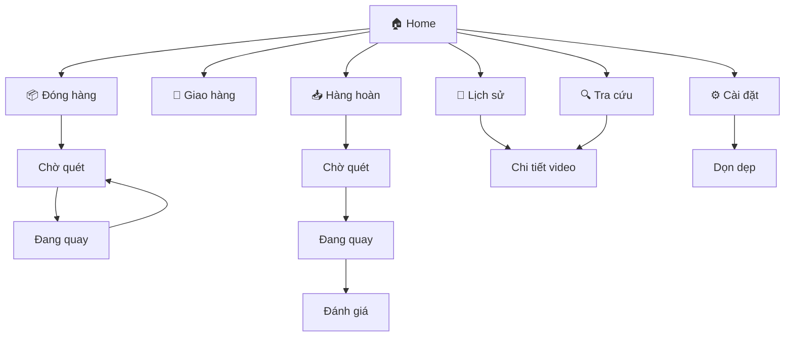

# Bố cục Màn hình (Screen Layouts)

Tài liệu này mô tả tất cả các màn hình trong ứng dụng Allship Record.

---

## 1. Màn hình Chính (Home / Dashboard)

```
+--------------------------------------------------+
|           🏠 ALLSHIP RECORD                      |
|                                                  |
|  Xin chào, [Tên Shop]!                          |
|--------------------------------------------------+
|                                                  |
|  +--------------------+  +--------------------+  |
|  |                    |  |                    |  |
|  |   📦 ĐÓNG HÀNG     |  |   🚚 GIAO HÀNG     |  |
|  |                    |  |                    |  |
|  |   [Bắt đầu quay]   |  |   [Bắt đầu quay]   |  |
|  +--------------------+  +--------------------+  |
|                                                  |
|  +--------------------+  +--------------------+  |
|  |                    |  |                    |  |
|  |   📥 HÀNG HOÀN     |  |   🔍 TRA CỨU       |  |
|  |                    |  |                    |  |
|  |   [Bắt đầu quay]   |  |   [Tìm video]      |  |
|  +--------------------+  +--------------------+  |
|                                                  |
+--------------------------------------------------+
| [Hôm nay: 25 đơn]  [Dung lượng: 15GB còn trống] |
+--------------------------------------------------+
|  🏠 Home  |  📜 Lịch sử  |  ⚙️ Cài đặt          |
+--------------------------------------------------+
```

---

## 2. Màn hình Quay Video - Đóng Hàng (Packing Recording)

```
+--------------------------------------------------+
| ← Thoát       ● ĐANG QUAY          [Dừng] ⏹️    |
+--------------------------------------------------+
|                                                  |
|                                                  |
|     ╔══════════════════════════════════════╗     |
|     ║                                      ║     |
|     ║                                      ║     |
|     ║         CAMERA PREVIEW               ║     |
|     ║                                      ║     |
|     ║         (Chiếm 75% màn hình)         ║     |
|     ║                                      ║     |
|     ║     ┌─────────────────────┐          ║     |
|     ║     │  Reticle (Scan)     │          ║     |
|     ║     └─────────────────────┘          ║     |
|     ║                                      ║     |
|     ╚══════════════════════════════════════╝     |
|                                                  |
+--------------------------------------------------+
|  ┌──────────────────────────────────────────┐   |
|  │  MÃ ĐƠN: SPX038294671                    │   |
|  │  ⏱️ 00:45 / 05:00                         │   |
|  │  Loại: ĐÓNG GÓI                          │   |
|  └──────────────────────────────────────────┘   |
+--------------------------------------------------+
| 📶 Scanner: ✅ Kết nối  |  💾 Còn trống: 15GB   |
+--------------------------------------------------+
```

---

## 3. Màn hình Quay Video - Giao Hàng (Shipping Recording)

```
+--------------------------------------------------+
| ← Thoát       ● GIAO HÀNG          [Hoàn tất]   |
+--------------------------------------------------+
|                                                  |
|     ╔══════════════════════════════════════╗     |
|     ║                                      ║     |
|     ║         CAMERA PREVIEW               ║     |
|     ║                                      ║     |
|     ║     (Quay toàn cảnh bàn giao)        ║     |
|     ║                                      ║     |
|     ╚══════════════════════════════════════╝     |
|                                                  |
+--------------------------------------------------+
|  ┌──────────────────────────────────────────┐   |
|  │  📊 ĐÃ QUÉT: 15 đơn                      │   |
|  │  ⏱️ 03:25 (Đang quay liên tục)            │   |
|  │                                          │   |
|  │  Mã gần nhất: SPX038294671              │   |
|  │  Mã trước đó: VN987654321               │   |
|  └──────────────────────────────────────────┘   |
+--------------------------------------------------+
| [Quét thêm mã để điểm danh...]                  |
+--------------------------------------------------+
```

---

## 4. Màn hình Quay Video - Hàng Hoàn (Return Recording)

```
+--------------------------------------------------+
| ← Thoát       ● HÀNG HOÀN          [Dừng] ⏹️    |
+--------------------------------------------------+
|                                                  |
|     ╔══════════════════════════════════════╗     |
|     ║                                      ║     |
|     ║         CAMERA PREVIEW               ║     |
|     ║                                      ║     |
|     ║     (Quay mở hộp kiểm tra)           ║     |
|     ║                                      ║     |
|     ╚══════════════════════════════════════╝     |
|                                                  |
+--------------------------------------------------+
|  ┌──────────────────────────────────────────┐   |
|  │  MÃ ĐƠN: VN987654321                     │   |
|  │  ⏱️ 01:30 / 10:00                         │   |
|  │                                          │   |
|  │  📹 Video đóng gói gốc: [Xem]            │   |
|  │  📅 Đóng gói ngày: 01/02/2026            │   |
|  └──────────────────────────────────────────┘   |
+--------------------------------------------------+
| ⚠️ Nhớ quay rõ 6 mặt kiện hàng trước khi mở!    |
+--------------------------------------------------+
```

---

## 5. Màn hình Đánh giá Hàng Hoàn (Return Assessment)

```
+--------------------------------------------------+
|                 ĐÁNH GIÁ HÀNG HOÀN              |
+--------------------------------------------------+
|                                                  |
|  ┌──────────────────────────────────────────┐   |
|  │  [THUMBNAIL VIDEO VỪA QUAY]              │   |
|  │                                          │   |
|  │  MÃ ĐƠN: VN987654321                     │   |
|  │  Thời lượng: 02:15                        │   |
|  └──────────────────────────────────────────┘   |
|                                                  |
|  Tình trạng hàng hóa:                           |
|                                                  |
|  +----------------+  +----------------+          |
|  |                |  |                |          |
|  |  ✅ NGUYÊN VẸN  |  |  ❌ HƯ HỎNG    |          |
|  |                |  |                |          |
|  +----------------+  +----------------+          |
|                                                  |
|  +----------------+  +----------------+          |
|  |                |  |                |          |
|  |  ⚠️ TRÁO HÀNG  |  |  ❓ KHÁC       |          |
|  |                |  |                |          |
|  +----------------+  +----------------+          |
|                                                  |
|  Ghi chú: [_________________________________]   |
|                                                  |
|        [        LƯU ĐÁNH GIÁ        ]           |
|                                                  |
+--------------------------------------------------+
```

---

## 6. Màn hình Chờ Quét (Scan Ready / Idle)

```
+--------------------------------------------------+
| ← Thoát        CHỜ QUÉT MÃ           Menu ☰     |
+--------------------------------------------------+
|                                                  |
|                                                  |
|     ╔══════════════════════════════════════╗     |
|     ║                                      ║     |
|     ║         CAMERA PREVIEW               ║     |
|     ║                                      ║     |
|     ║     ┌─────────────────────┐          ║     |
|     ║     │                     │          ║     |
|     ║     │   🔲 QUÉT MÃ ĐÂY    │          ║     |
|     ║     │                     │          ║     |
|     ║     └─────────────────────┘          ║     |
|     ║                                      ║     |
|     ╚══════════════════════════════════════╝     |
|                                                  |
+--------------------------------------------------+
|                                                  |
|   🎤 Đưa mã vận đơn vào khung hoặc dùng Scanner |
|                                                  |
|               [ NHẬP TAY ]                       |
|                                                  |
+--------------------------------------------------+
| 📶 Scanner: ✅ Kết nối  |  💾 Còn trống: 15GB   |
+--------------------------------------------------+
```

---

## 7. Màn hình Lịch sử / Tra cứu (History / Search)

```
+--------------------------------------------------+
|                   📜 LỊCH SỬ                     |
+--------------------------------------------------+
|  🔍 [ Nhập mã vận đơn để tìm kiếm...        ]   |
+--------------------------------------------------+
|  Lọc: [Tất cả ▼]  [Hôm nay ▼]  [Sắp xếp ▼]      |
+--------------------------------------------------+
|                                                  |
|  ┌────────────────────────────────────────────┐ |
|  │ [📹]  SPX038294671                         │ |
|  │       📦 Đóng gói  |  10:30  |  45 giây     │ |
|  │       ───────────────────────────────────  │ |
|  └────────────────────────────────────────────┘ |
|                                                  |
|  ┌────────────────────────────────────────────┐ |
|  │ [📹]  VN987654321                          │ |
|  │       📥 Hàng hoàn  |  14:15  |  2 phút     │ |
|  │       [TAG: ❌ HƯ HỎNG]                     │ |
|  │       ───────────────────────────────────  │ |
|  └────────────────────────────────────────────┘ |
|                                                  |
|  ┌────────────────────────────────────────────┐ |
|  │ [📹]  SPX111222333                         │ |
|  │       🚚 Giao hàng  |  16:00  |  5 phút     │ |
|  │       [15 đơn trong batch]                 │ |
|  │       ───────────────────────────────────  │ |
|  └────────────────────────────────────────────┘ |
|                                                  |
|  [Tải thêm...]                                  |
|                                                  |
+--------------------------------------------------+
|  🏠 Home  |  📜 Lịch sử  |  ⚙️ Cài đặt          |
+--------------------------------------------------+
```

---

## 8. Màn hình Chi tiết Video (Video Detail / Player)

```
+--------------------------------------------------+
| ← Quay lại                          [⋮ Menu]    |
+--------------------------------------------------+
|                                                  |
|  ╔══════════════════════════════════════════╗   |
|  ║                                          ║   |
|  ║              VIDEO PLAYER                ║   |
|  ║                                          ║   |
|  ║           advancement: ▶️ advancement:   ║   |
|  ║                                          ║   |
|  ║    advancement: 00:15 ━━━━━●━━━ 00:45     ║   |
|  ╚══════════════════════════════════════════╝   |
|                                                  |
|  ┌──────────────────────────────────────────┐   |
|  │  MÃ ĐƠN: SPX038294671                    │   |
|  │  Loại: 📦 Đóng gói                       │   |
|  │  Ngày quay: 03/02/2026 lúc 10:30         │   |
|  │  Thời lượng: 45 giây                      │   |
|  │  Kích thước: 12.5 MB                      │   |
|  │  Thiết bị: Samsung Galaxy A54             │   |
|  └──────────────────────────────────────────┘   |
|                                                  |
|  +------------+  +------------+  +------------+ |
|  |            |  |            |  |            | |
|  |  📤 CHIA SẺ |  |  💾 XUẤT   |  |  🗑️ XÓA   | |
|  |            |  |            |  |            | |
|  +------------+  +------------+  +------------+ |
|                                                  |
+--------------------------------------------------+
```

---

## 9. Màn hình Cài đặt (Settings)

```
+--------------------------------------------------+
|                   ⚙️ CÀI ĐẶT                     |
+--------------------------------------------------+
|                                                  |
|  📷 THIẾT BỊ                                     |
|  ├─ Camera              [Camera Sau      ▼]     |
|  ├─ Microphone          [    🔘 Bật      ]     |
|  └─ Scanner             [Đã kết nối ✅   ]     |
|                                                  |
|  ──────────────────────────────────────────     |
|                                                  |
|  🎬 VIDEO                                        |
|  ├─ Độ phân giải        [720p HD         ▼]     |
|  ├─ Thời lượng tối đa   [5 phút          ▼]     |
|  └─ Chất lượng          [Cân bằng        ▼]     |
|                                                  |
|  ──────────────────────────────────────────     |
|                                                  |
|  💾 LƯU TRỮ                                      |
|  ├─ Đã sử dụng          [45 GB / 128 GB  ]     |
|  ├─ Tự động xóa sau     [90 ngày         ▼]     |
|  └─ [      🗑️ DỌN DẸP BỘ NHỚ       ]           |
|                                                  |
|  ──────────────────────────────────────────     |
|                                                  |
|  🎨 GIAO DIỆN                                    |
|  ├─ Chế độ tối          [    🔘 Bật      ]     |
|  └─ Âm thanh phản hồi   [    🔘 Bật      ]     |
|                                                  |
|  ──────────────────────────────────────────     |
|                                                  |
|  ℹ️ THÔNG TIN                                    |
|  ├─ Phiên bản           [1.0.0           ]     |
|  └─ [      📖 HƯỚNG DẪN SỬ DỤNG     ]           |
|                                                  |
+--------------------------------------------------+
|  🏠 Home  |  📜 Lịch sử  |  ⚙️ Cài đặt          |
+--------------------------------------------------+
```

---

## 10. Màn hình Dọn dẹp Bộ nhớ (Storage Cleanup)

```
+--------------------------------------------------+
| ← Quay lại         DỌN DẸP BỘ NHỚ               |
+--------------------------------------------------+
|                                                  |
|  ┌──────────────────────────────────────────┐   |
|  │  💾 TÌNH TRẠNG BỘ NHỚ                    │   |
|  │                                          │   |
|  │  ████████████████░░░░░░  75%            │   |
|  │  Đã dùng: 96 GB / 128 GB                 │   |
|  │  Video: 1,234 files                       │   |
|  └──────────────────────────────────────────┘   |
|                                                  |
|  Chọn dữ liệu cần xóa:                          |
|                                                  |
|  [✓] Video cũ hơn 90 ngày           (45 GB)    |
|  [ ] Video đã sync lên Cloud         (20 GB)    |
|  [ ] Video đóng gói (giữ hàng hoàn)  (25 GB)    |
|  [ ] TẤT CẢ VIDEO                    (96 GB)    |
|                                                  |
|  ⚠️ Video đang tranh chấp sẽ KHÔNG bị xóa.      |
|                                                  |
|  ┌──────────────────────────────────────────┐   |
|  │  Sẽ xóa: 512 videos (45 GB)              │   |
|  │                                          │   |
|  │       [     🗑️ XÓA NGAY     ]            │   |
|  └──────────────────────────────────────────┘   |
|                                                  |
+--------------------------------------------------+
```

---

## 11. Màn hình Nhập tay Mã đơn (Manual Input)

```
+--------------------------------------------------+
| ← Hủy                 NHẬP MÃ ĐƠN               |
+--------------------------------------------------+
|                                                  |
|                                                  |
|  ┌──────────────────────────────────────────┐   |
|  │                                          │   |
|  │    Nhập mã vận đơn:                      │   |
|  │                                          │   |
|  │    ┌────────────────────────────────┐    │   |
|  │    │  SPX038294671                  │    │   |
|  │    └────────────────────────────────┘    │   |
|  │                                          │   |
|  └──────────────────────────────────────────┘   |
|                                                  |
|                                                  |
|  ┌───┬───┬───┬───┬───┬───┬───┬───┬───┬───┐     |
|  │ 1 │ 2 │ 3 │ 4 │ 5 │ 6 │ 7 │ 8 │ 9 │ 0 │     |
|  ├───┼───┼───┼───┼───┼───┼───┼───┼───┼───┤     |
|  │ Q │ W │ E │ R │ T │ Y │ U │ I │ O │ P │     |
|  ├───┼───┼───┼───┼───┼───┼───┼───┼───┼───┤     |
|  │ A │ S │ D │ F │ G │ H │ J │ K │ L │ ⌫ │     |
|  ├───┼───┼───┼───┼───┼───┼───┼───┼───┼───┤     |
|  │ ⇧ │ Z │ X │ C │ V │ B │ N │ M │   XÁC   │   |
|  │   │   │   │   │   │   │   │   │   NHẬN  │   |
|  └───┴───┴───┴───┴───┴───┴───┴───┴─────────┘   |
|                                                  |
+--------------------------------------------------+
```

---

## 12. Màn hình Cảnh báo / Lỗi (Error / Warning Modal)

### 12a. Cảnh báo Bộ nhớ Đầy
```
+--------------------------------------------------+
|                                                  |
|     ╔══════════════════════════════════════╗     |
|     ║                                      ║     |
|     ║       ⚠️ CẢNH BÁO BỘ NHỚ ĐẦY         ║     |
|     ║                                      ║     |
|     ║   Chỉ còn 500 MB bộ nhớ trống.       ║     |
|     ║   Không thể quay video mới.          ║     |
|     ║                                      ║     |
|     ║   ┌─────────────┐  ┌─────────────┐   ║     |
|     ║   │  DỌN DẸP    │  │   ĐÓNG      │   ║     |
|     ║   └─────────────┘  └─────────────┘   ║     |
|     ║                                      ║     |
|     ╚══════════════════════════════════════╝     |
|                                                  |
+--------------------------------------------------+
```

### 12b. Lỗi Mất Camera
```
+--------------------------------------------------+
|                                                  |
|     ╔══════════════════════════════════════╗     |
|     ║                                      ║     |
|     ║       🚨 MẤT KẾT NỐI CAMERA          ║     |
|     ║                                      ║     |
|     ║   Video đã được lưu đến giây 00:45.  ║     |
|     ║                                      ║     |
|     ║   Đang thử kết nối lại...            ║     |
|     ║        🔄 (3/5)                       ║     |
|     ║                                      ║     |
|     ║   ┌─────────────┐  ┌─────────────┐   ║     |
|     ║   │  THỬ LẠI    │  │   HỦY       │   ║     |
|     ║   └─────────────┘  └─────────────┘   ║     |
|     ║                                      ║     |
|     ╚══════════════════════════════════════╝     |
|                                                  |
+--------------------------------------------------+
```

### 12c. Cảnh báo Quét Trùng
```
+--------------------------------------------------+
|                                                  |
|     ╔══════════════════════════════════════╗     |
|     ║                                      ║     |
|     ║       ⚠️ MÃ ĐƠN TRÙNG LẶP           ║     |
|     ║                                      ║     |
|     ║   Mã SPX038294671 đang được quay!    ║     |
|     ║                                      ║     |
|     ║   ┌───────────────────────────────┐  ║     |
|     ║   │      BỎ QUA, TIẾP TỤC         │  ║     |
|     ║   └───────────────────────────────┘  ║     |
|     ║                                      ║     |
|     ╚══════════════════════════════════════╝     |
|                                                  |
+--------------------------------------------------+
```

---

## 13. Màn hình Thống kê (Statistics - Optional)

```
+--------------------------------------------------+
|                   📊 THỐNG KÊ                    |
+--------------------------------------------------+
|                                                  |
|  Khoảng thời gian: [Tháng này ▼]                |
|                                                  |
|  ┌──────────────────────────────────────────┐   |
|  │                                          │   |
|  │   Tổng số video:          1,234          │   |
|  │   ├─ Đóng gói:              980          │   |
|  │   ├─ Giao hàng:             200          │   |
|  │   └─ Hàng hoàn:              54          │   |
|  │                                          │   |
|  │   Dung lượng sử dụng:      45 GB         │   |
|  │   Thời lượng tổng:        15 giờ         │   |
|  │                                          │   |
|  └──────────────────────────────────────────┘   |
|                                                  |
|  Hàng hoàn theo tình trạng:                     |
|  ┌──────────────────────────────────────────┐   |
|  │  ✅ Nguyên vẹn:    35   (65%)            │   |
|  │  ❌ Hư hỏng:       15   (28%)            │   |
|  │  ⚠️ Tráo hàng:      4   (7%)             │   |
|  └──────────────────────────────────────────┘   |
|                                                  |
+--------------------------------------------------+
|  🏠 Home  |  📜 Lịch sử  |  ⚙️ Cài đặt          |
+--------------------------------------------------+
```

---

## 14. Màn hình Onboarding (First-time Setup)

### 14a. Welcome Screen
```
+--------------------------------------------------+
|                                                  |
|                                                  |
|              🎬 ALLSHIP RECORD                   |
|                                                  |
|        Quay video đóng hàng chuyên nghiệp       |
|           Bảo vệ quyền lợi của bạn              |
|                                                  |
|                                                  |
|                                                  |
|        [        BẮT ĐẦU SETUP        ]          |
|                                                  |
|                                                  |
+--------------------------------------------------+
```

### 14b. Camera Setup
```
+--------------------------------------------------+
|           BƯỚC 1/3: THIẾT LẬP CAMERA            |
+--------------------------------------------------+
|                                                  |
|     ╔══════════════════════════════════════╗     |
|     ║                                      ║     |
|     ║         CAMERA PREVIEW               ║     |
|     ║                                      ║     |
|     ║     Đặt điện thoại/camera ở vị trí   ║     |
|     ║     có thể nhìn thấy bàn đóng gói    ║     |
|     ║                                      ║     |
|     ╚══════════════════════════════════════╝     |
|                                                  |
|  📷 Chọn Camera:                                 |
|  ( ) Camera Sau                                  |
|  (●) Camera Trước                                |
|                                                  |
|  💡 Tips: Đặt điện thoại trên giá đỡ/tripod     |
|                                                  |
|        [   ← QUAY LẠI   ]  [   TIẾP TỤC →   ]   |
|                                                  |
+--------------------------------------------------+
```

### 14c. Scanner Setup
```
+--------------------------------------------------+
|           BƯỚC 2/3: KẾT NỐI SCANNER             |
+--------------------------------------------------+
|                                                  |
|  Bạn có máy quét mã vạch không?                 |
|                                                  |
|  +--------------------------------------------+ |
|  |                                            | |
|  |  📱 DÙNG CAMERA ĐIỆN THOẠI                 | |
|  |     Quét mã bằng camera (Khuyến nghị       | |
|  |     cho shop nhỏ)                          | |
|  |                                            | |
|  +--------------------------------------------+ |
|                                                  |
|  +--------------------------------------------+ |
|  |                                            | |
|  |  📟 CÓ MÁY QUÉT BLUETOOTH                  | |
|  |     Kết nối máy quét rời (Nhanh hơn)       | |
|  |                                            | |
|  +--------------------------------------------+ |
|                                                  |
|  +--------------------------------------------+ |
|  |                                            | |
|  |  🔌 CÓ MÁY QUÉT USB                        | |
|  |     Chỉ dành cho Desktop                   | |
|  |                                            | |
|  +--------------------------------------------+ |
|                                                  |
|        [   ← QUAY LẠI   ]  [   TIẾP TỤC →   ]   |
|                                                  |
+--------------------------------------------------+
```

### 14d. Ready Screen
```
+--------------------------------------------------+
|           BƯỚC 3/3: SẴN SÀNG!                   |
+--------------------------------------------------+
|                                                  |
|                    ✅                            |
|                                                  |
|           Thiết lập hoàn tất!                   |
|                                                  |
|  ┌──────────────────────────────────────────┐   |
|  │  📷 Camera: Camera Sau                   │   |
|  │  📟 Scanner: Camera điện thoại           │   |
|  │  💾 Bộ nhớ: 45 GB còn trống              │   |
|  └──────────────────────────────────────────┘   |
|                                                  |
|  💡 Mẹo sử dụng:                                |
|  • Quét mã → Tự động bắt đầu quay               |
|  • Quét mã mới → Lưu video cũ, quay video mới   |
|  • Bấm Dừng → Kết thúc phiên làm việc           |
|                                                  |
|        [     BẮT ĐẦU ĐÓNG HÀNG     ]            |
|                                                  |
+--------------------------------------------------+
```

---

## 15. Tổng kết Flow Điều hướng


